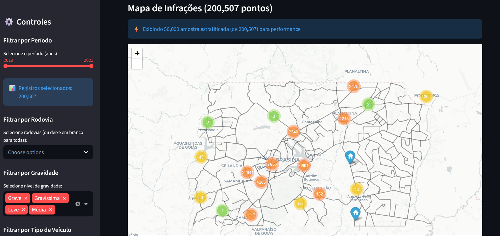

# Infradata

[](https://github.com/lucasmalinski/infradata/actions/workflows/test.yml)



## Considerações Importantes

Requisito: Conda (Miniconda ou Anaconda) deve estar instalado antes de criar o ambiente.

Nota: o principal motivo para recomendar Conda neste projeto é o uso de `geopandas` e suas dependências nativas. Instalar esses pacotes via Conda (conda-forge) evita builds problemáticos e reduz o risco de quebrar bibliotecas Python globais do sistema.

Infelizmente, devido ao tamanho do dataset fonte, e à restrições de ambiente de plataformas como vercel e streamlit, duas restrições severas precisam ser resolvidas para a entrega final:

> 1) Disponibilização dos dados brutos via Datalake (via Cloud, ex.: Azure blob storage)
> 2) Engessamento do ambiente conda através de dockerfile. Geopandas possui sub-dependências compiladas em C e costumeiramente quebra dependências quando instalado via pip.

Este repositório fornece um arquivo `environment.yml` pronto para criar um ambiente Conda com as dependências necessárias e instalar o package local `infradata` em modo editável.

Para criar e ativar o ambiente, execute na pasta do projeto:

```bash
conda env create -f environment.yml
conda activate infradata_env
```

O `environment.yml` instala `pandas` via Conda e ainda instala o package local em modo editável (`-e .`).

## Dados brutos

### Baixar Dados Brutos

[Dados Brutos](https://drive.google.com/drive/folders/1TcY1214yzoNUmIazm7YW0Z-pEd1Hwp3x?usp=sharing)

Os arquivos de dados brutos não estão versionados neste repositório (veja `.gitignore`). Antes de rodar o pipeline, coloque os dados sob a árvore `data/raw/` seguindo a mesma estrutura usada localmente (ex.: `data/raw/historico_infracao/`, `data/raw/hist_fluxo/`, etc.)

Resumo rápido:

- Dados brutos: `data/raw/` (não comitados)
- Caches / arquivos baixados: `data/external/` e `data\raw\historico_infracao`
- Saída processada: `data/silver/`

## Execução da Pipeline
>
> **Após ativar o ambiente conda!**

Execute o pipeline principal para gerar a camada silver de dados (necessária para o funcionamento do app streamlit):

```bash
python scripts/run_pipeline.py
```

Para notebooks, e execuções interativas selecione o kernel do ambiente conda `infradata_env`.

Observação: se você precisar de dependências nativas extras, instale-as via pip se não houver conda packages disponíveis.

## Visualização Interativa (Streamlit)

Para executar a aplicação interativa de visualização de infrações após rodar a pipeline de transformação dos dados:

```bash
# Com o ambiente conda ativado
streamlit run src/infradata/visualization/streamlit_app.py
```

A aplicação abre em `http://localhost:8501` e permite:

- Visualizar ~200k infrações georreferenciadas (2019-2023) em mapa interativo
- Filtrar por ano, severidade, rodovia e tipo de veículo
- Visualizar overlay de geometrias de rodovias (GeoJSON)
- Performance otimizada com caching de dados e GeoJSON

### Nota sobre deployment

**Não foi utilizado Streamlit Cloud para este projeto** devido às limitações com dependências nativas do `geopandas`. Streamlit Cloud tem dificuldade em resolver builds nativos complexos (GEOS, PROJ, etc.).

## Arquivo de caminhos (commitado)

Este repositório inclui `data_paths.env` com valores padrão para os caminhos de dados públicos. O projeto ainda suporta um arquivo legacy `.env`, mas `data_paths.env` é preferido para deixar claro que o arquivo contém apenas paths públicos.
